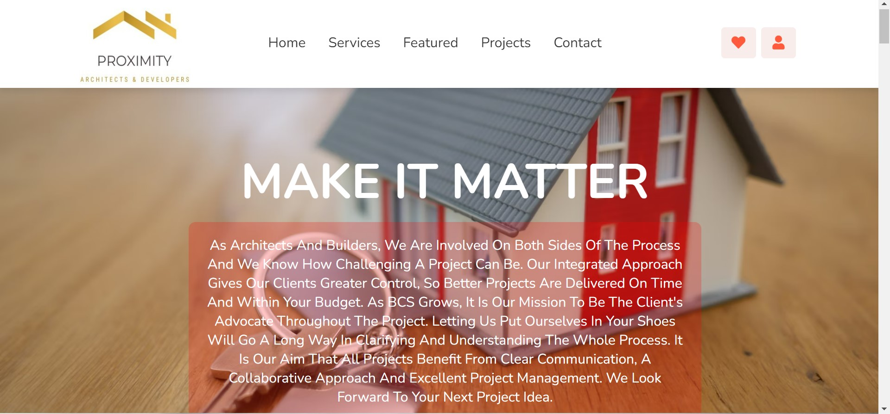
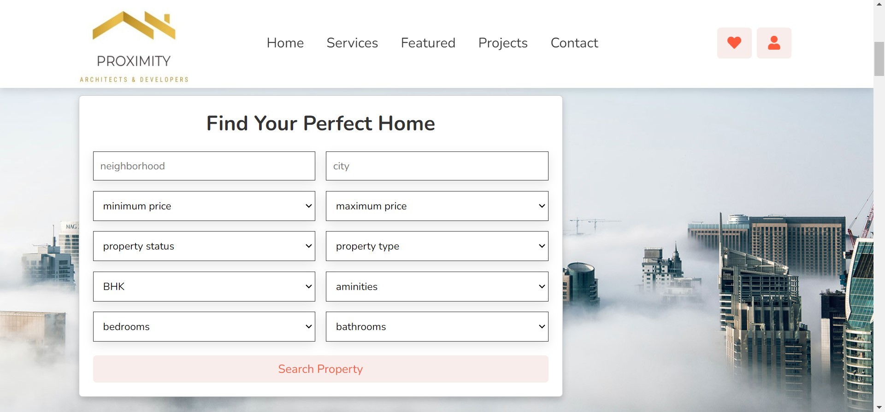
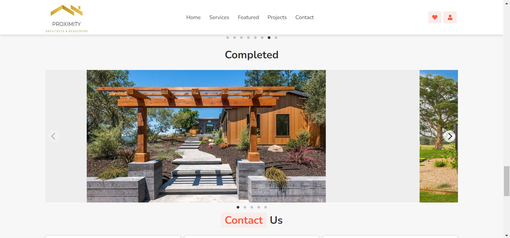
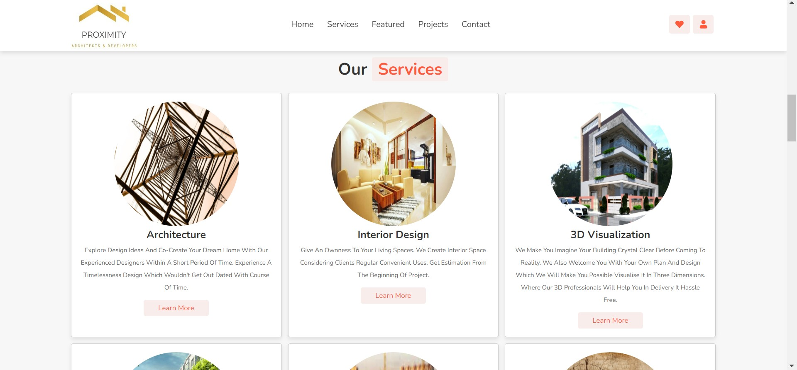

# Basic-Web-Application
A sleek web application leveraging HTML, CSS, and Bootstrap designed exclusively for Proximity Developers and Architects, facilitating seamless collaboration and streamlined project management.

About:
======

Introducing a cutting-edge web application designed specifically for Proximity Developers and Architects. With its sleek interface and seamless integration of HTML, CSS, and Bootstrap, it revolutionizes collaboration and project management, empowering professionals to effortlessly connect, communicate, and innovate within their local network.

